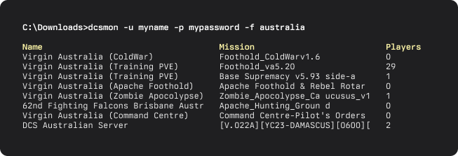

## dcsmon

Command-line server browser for Digital Combat Simulator so you can monitor your favorite servers

## Installation

Download the dcsmon.exe executable from the releases page

## Usage
Uses your DCS username and password

    dcsmon.exe -u username -p password -f filtertext

## Build

    cargo build